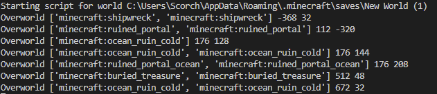
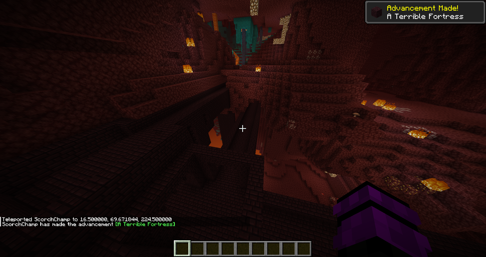

# minecraft-structure-finder

<p align="center">
  <p align="center">
    <br />
    <a href="https://github.com/ScorchChamp/minecraft-structure-finder/releases/">Releases &#187;</a>
    <br />
    <br />
    <a href="https://github.com/ScorchChamp/minecraft-structure-finder">View Demo</a> |
    <a href="https://github.com/ScorchChamp/minecraft-structure-finder/wiki">Wiki</a> |
    <a href="https://github.com/ScorchChamp/minecraft-structure-finder/issues">Report Bug</a> |
    <a href="https://github.com/ScorchChamp/minecraft-structure-finder/issues">Request Feature</a>
  </p>
</p>


-------------


👋 Welcome to the Minecraft Undetectable Live Structure Finder!

Are you tired of spending hours upon hours scouring your Minecraft world for structures? Do you want to easily find them without the use of mods? Look no further! 🎉

Our script, run.py, will automatically detect the newest Minecraft world in '%appdata%/.minecraft/saves/\*' and search for rendered structures in real-time. That's right, no more wasting time searching for structures that have already been rendered.

Our script is completely undetectable by third parties 😎, so you don't have to worry about any complicated mods or add-ons - our script does all the work for you! ⚡️

Keep an eye on the console for new lines - this means that the script has found a new structure! 🤩 The coordinates in the console directly correspond to the 'CHUNK'-coordinate of the structure, making it even easier to find buried treasures and other hidden gems. 🚀

Please note that this script is not intended for use in speedruns, as it could be considered cheating. 





## Features

🚀 Real-time Detection: Our script detects rendered structures in real-time, so you can find them as soon as they're rendered!

😎 No Mods Required: Our script is so easy to use that you don't need any mods or add-ons to use it.

🌎 Automatic Detection: The script automatically detects the newest Minecraft world in '%appdata%/.minecraft/saves/*', so you don't have to worry about selecting the right world.

🔍 Coordinate Correspondence: The coordinates in the console directly correspond to the 'CHUNK'-coordinate of the structure, making it even easier to find buried treasures and other hidden gems.

👻 Undetectable by Third Parties: You can use our script without worrying about getting banned or detected by third parties.


## Usage

Run the follow command, and it will start searching your latest rendered world

```cmd
python3 run.py
```

## Contributing

Contributions are what make the open source community such an amazing place to be learn, inspire, and create. Any contributions you make are **greatly appreciated**.

1. Fork the Project
2. Create your Feature Branch (`git checkout -b feature/AmazingFeature`)
3. Commit your Changes (`git commit -m 'Add some AmazingFeature'`)
4. Push to the Branch (`git push origin feature/AmazingFeature`)
5. Open a Pull Request


## Tech Stack

 - Python

## Support

For support, open a pull request or open an issue [here](https://github.com/ScorchChamp/minecraft-structure-finder/issues/new)

## License


<!--This file was generated via https://github.com/ScorchChamp/README.md-generator Credits to: ScorchChamp-->
        
